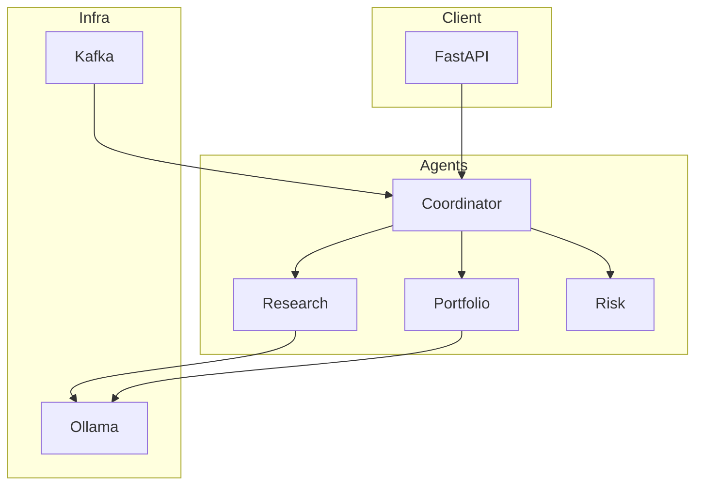
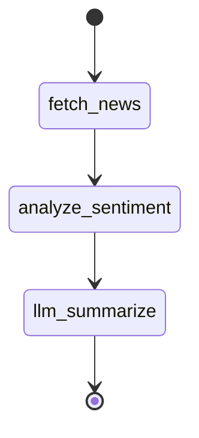
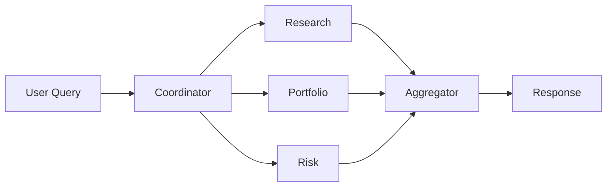
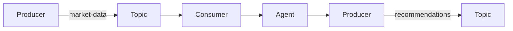

# QuantGPT Agentic — Architecture

> **Purpose:** System overview, components, and data flow. Update as you implement each phase.

---

## High-Level Architecture

```
┌─────────────────────────────────────────────────────────────────────────────┐
│                        QuantGPT Agentic Platform                             │
├─────────────────────────────────────────────────────────────────────────────┤
│  FastAPI (OpenAPI)  →  Agent Orchestrator  →  Multi-Agent System            │
│       │                         │                        │                   │
│       │                         │              ┌────────┼────────┐          │
│       │                         │              ▼        ▼        ▼          │
│       │                         │         Research  Portfolio  Risk         │
│       │                         │         Agent    Agent      Agent         │
│       │                         │              │        │        │          │
│       └────────────────────────┴──────────────┴────────┴────────┘          │
│                                         │                                    │
│                              Kafka Event Bus                                │
│                                         │                                    │
│                    ┌────────────────────┼────────────────────┐               │
│                    ▼                    ▼                    ▼               │
│              AgentOps            Tool Registry         Ollama (LLM)          │
│          (Monitoring/Logging)    (Versioned)           local inference       │
└─────────────────────────────────────────────────────────────────────────────┘
```

---

## Mermaid Diagrams

### 1. System Overview



### 2. Research Agent (LangGraph) — Phase 3



### 3. Multi-Agent Flow — Phase 4



### 4. Kafka Event Pipeline — Phase 5



---

## Component Descriptions

### API Layer (Phase 2)
- **FastAPI** app in `src/quantgpt/api/`
- Endpoints: `/health`, `/api/v1/models`, `/api/v1/research`, `/api/v1/recommendations`
- OpenAPI docs at `/docs`, spec at `/openapi.json`

#### API Request Flow (Sequence Diagram)

```
Client          FastAPI Router      Pydantic          Handler           Response
  │                    │                │                 │                 │
  │  GET /health       │                │                 │                 │
  │──────────────────>│                │                 │                 │
  │                    │  validate      │                 │                 │
  │                    │──────────────>│                 │                 │
  │                    │  (none)       │                 │                 │
  │                    │<──────────────│                 │                 │
  │                    │  invoke       │                 │                 │
  │                    │──────────────────────────────>│                 │
  │                    │               │  HealthResponse │                 │
  │                    │               │<─────────────────────────────────│
  │                    │  serialize    │                 │                 │
  │                    │  (JSON)       │                 │                 │
  │  {status, version}  │                 │                 │                 │
  │<──────────────────│                │                 │                 │
```

### Agent Layer (Phases 1, 3, 4)
- **BaseAgent**, **BaseTool** — abstract classes in `src/quantgpt/agents/base.py`
- **MathAgent** — Phase 1 demo agent using CalculatorTool (replaced by specialists in Phase 3+)
- **ResearchAgent** — news + sentiment + synthesis (LangGraph)
- **PortfolioAgent** — allocation suggestions
- **RiskAgent** — risk checks
- **CoordinatorAgent** — routes queries to specialists

#### Agent Layer Design (Phase 1)

```
┌─────────────────────────────────────────────────────────────────────────────┐
│                         AGENT LAYER CLASS DIAGRAM                           │
├─────────────────────────────────────────────────────────────────────────────┤
│                                                                             │
│   BaseTool (ABC)                    BaseAgent (ABC)                          │
│   ├── name: str                     ├── tools: list[BaseTool]  (injected)   │
│   ├── description: str              ├── name: str                           │
│   └── execute(**kwargs) -> Any      ├── _call_tool(name, **kwargs)          │
│            ▲                        └── run(query) -> str  (abstract)       │
│            │                                 ▲                              │
│            │                                 │                              │
│   CalculatorTool                    MathAgent | ResearchAgent | ...         │
│   └── execute(operation, a, b)       └── run() implements domain logic      │
│                                                                             │
└─────────────────────────────────────────────────────────────────────────────┘
```

**Design principles:**
- **Dependency injection:** Agents receive `tools` in constructor, not hardcoded
- **Single Responsibility:** Each tool does one thing; each agent owns one domain
- **Open/Closed:** Add new agents by extending BaseAgent; add tools by extending BaseTool

### Tools (Phase 1, 3)
- `fetch_market_news` — fetches/parses news (mock or real API)
- `analyze_sentiment` — sentiment score
- `calculate_sharpe_ratio` — portfolio metric
- Extensible via `BaseTool`

### Event Layer (Phase 5)
- **Kafka topics:** `market-data`, `recommendations`
- **Producer:** Emits market events
- **Consumer:** Triggers agents, emits recommendations

### AgentOps (Phase 6)
- **structlog** — JSON logs, trace ID, agent name
- **Prometheus** — `agent_invocations_total`, `agent_latency_seconds`, `agent_errors_total`
- `/metrics` endpoint

---

## Target Project Structure

```
QuantGPT/
├── src/quantgpt/
│   ├── api/                    # FastAPI (Phase 2)
│   │   ├── main.py
│   │   ├── routes/
│   │   └── schemas/
│   ├── agents/                 # Agents (Phases 1, 3, 4)
│   │   ├── base.py
│   │   ├── research_agent.py
│   │   ├── portfolio_agent.py
│   │   ├── risk_agent.py
│   │   └── orchestrator.py
│   ├── tools/                  # Agent tools
│   ├── events/                 # Kafka (Phase 5)
│   │   ├── producer.py
│   │   └── consumer.py
│   ├── agentops/               # Observability (Phase 6)
│   │   ├── metrics.py
│   │   └── logging.py
│   ├── nlp/                    # Existing
│   ├── forecasting/            # Existing
│   ├── portfolio/              # Existing
│   └── dashboard/              # Existing
├── docs/
│   ├── IMPLEMENTATION_PLAN.md
│   ├── ARCHITECTURE.md
│   ├── LEARNING_LOG.md
│   └── INTERVIEW_PREP.md
├── tests/
├── docker-compose.yml          # Kafka (Phase 5)
└── pyproject.toml
```

---

## Design Principles

1. **Dependency injection** — Agents receive LLM, tools via constructor
2. **Abstract base classes** — Common interface for all agents
3. **Event-driven** — Kafka for async, decoupled flows
4. **Observability-first** — Trace IDs, structured logs, metrics from day one
